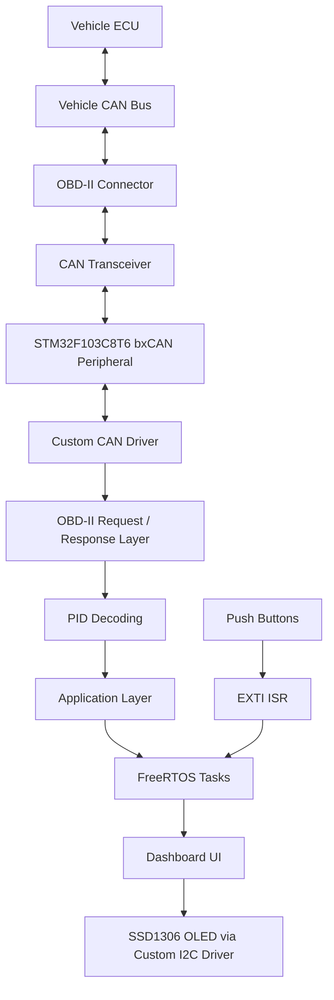
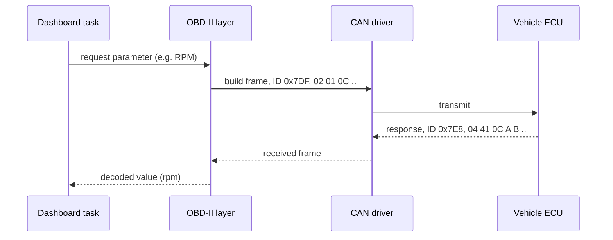
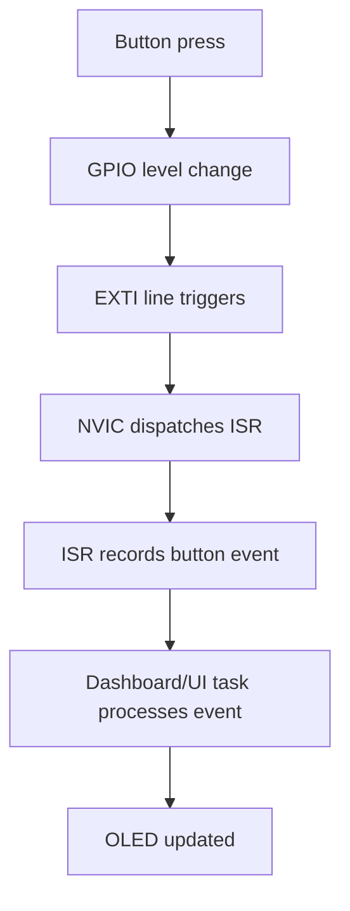
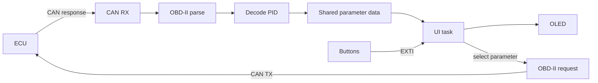
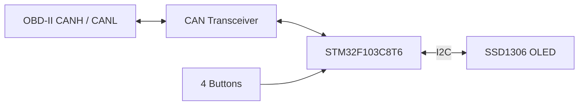

# Automotive Dashboard using FreeRTOS, CMSIS and STM32F103C8T6

A custom embedded automotive dashboard built around the **STM32F103C8T6** (ARM Cortex-M3, "Blue Pill"). The firmware talks to a vehicle's ECU over the **OBD-II / CAN** diagnostic interface, requests and decodes standard OBD-II PIDs, and shows live vehicle parameters on a **0.96" SSD1306 OLED (128×64)** through a button-driven menu.

Peripheral drivers (I2C, SSD1306, CAN, EXTI-based input) and the application layer are written for this project, and the firmware is organised into **FreeRTOS** tasks. The system has been exercised against a real vehicle, not only simulated CAN traffic.

| | |
|---|---|
| **MCU** | STM32F103C8T6 (Cortex-M3, 72 MHz max, 64 KB Flash / 20 KB SRAM) |
| **RTOS** | FreeRTOS (via the CMSIS-RTOS v2 wrapper) |
| **Bus / Protocol** | CAN 2.0A (11-bit IDs), OBD-II over ISO 15765-4 |
| **Display** | SSD1306 OLED, 128×64, I2C |
| **Toolchain** | STM32CubeIDE, GNU Arm Embedded (GCC), ST-Link (SWD) |

---

## Table of Contents

1. [Overview](#overview)
2. [Motivation](#motivation)
3. [Key Features](#key-features)
4. [System Architecture](#system-architecture)
5. [Hardware Used](#hardware-used)
6. [Software / Technology Stack](#software--technology-stack)
7. [Firmware Architecture](#firmware-architecture)
8. [CMSIS / Bare-Metal Approach](#cmsis--bare-metal-approach)
9. [CAN Communication](#can-communication)
10. [OBD-II and PID Processing](#obd-ii-and-pid-processing)
11. [FreeRTOS Architecture](#freertos-architecture)
12. [OLED Dashboard UI](#oled-dashboard-ui)
13. [Button and EXTI Interrupt Handling](#button-and-exti-interrupt-handling)
14. [Custom Drivers](#custom-drivers)
15. [Project Structure](#project-structure)
16. [Data Flow](#data-flow)
17. [Testing and Validation](#testing-and-validation)
18. [Supported Parameters](#supported-parameters)
19. [Future Improvements](#future-improvements)
20. [Build and Flash Instructions](#build-and-flash-instructions)
21. [Hardware Connection Overview](#hardware-connection-overview)
22. [Limitations](#limitations)
23. [Learning Outcomes](#learning-outcomes)
24. [Author](#author)
25. [Repository](#repository)

> **Note on `TODO` markers:** blockquotes starting with **TODO** mark details that must be filled in from the source before publishing (pin numbers, exact task names, IPC mechanism, etc.). Delete each one once resolved.

---

## Overview

Modern vehicles expose diagnostic data through the OBD-II port. On CAN-based vehicles, a diagnostic tool sends request frames to the ECU and the ECU replies with response frames containing raw sensor data. This project implements that request/response loop on a microcontroller and turns the result into a small in-vehicle dashboard.

The firmware:

- initialises the STM32 CAN peripheral and exchanges frames with the vehicle's CAN bus through an external CAN transceiver,
- builds OBD-II request frames, parses the ECU's responses, and converts raw bytes into physical values,
- renders a menu and live values on an SSD1306 OLED over I2C,
- reads user input from push buttons via EXTI interrupts,
- runs these responsibilities as FreeRTOS tasks.

## Motivation

The project was built to learn embedded systems by working close to the hardware: understanding how CAN frames are structured and filtered, how OBD-II sits on top of CAN, how an SSD1306 is actually driven over I2C, and how an RTOS keeps communication, UI and input responsive at the same time. The guiding idea is:

> *Build the drivers and understand the hardware instead of simply importing libraries.*

## Key Features

**Implemented**

- Custom **I2C** driver and custom **SSD1306** OLED driver (no third-party display library)
- Custom **CAN** driver for STM32 bxCAN (configuration, transmit, receive)
- **OBD-II** PID request/response handling over CAN, with decoding to physical units
- **Menu-driven UI** on a 128×64 OLED with per-parameter live views
- **EXTI interrupt-driven** button input (UP / DOWN / SELECT / BACK)
- **FreeRTOS**-based task structure
- CAN loopback testing and validation against a real vehicle

**Planned** (not implemented; see [Future Improvements](#future-improvements))

- DTC reading/clearing, graphical gauges, data logging, watchdog, CAN timeout/fault handling, and more

## System Architecture



## Hardware Used

| Component | Role |
|---|---|
| STM32F103C8T6 "Blue Pill" | Main MCU (Cortex-M3) |
| CAN transceiver | Converts MCU CAN TX/RX logic levels to the vehicle's differential CANH/CANL |
| OBD-II connector / cable | Access to the vehicle's diagnostic CAN lines |
| 0.96" OLED, 128×64 (SSD1306, I2C) | Dashboard display |
| Push buttons | UP, DOWN, SELECT/OK, BACK |
| ST-Link (SWD) | Programming and debugging |

> **TODO:** add the exact CAN transceiver part number (and its logic supply level relative to the 3.3 V MCU), plus the OBD-II pins used (CAN-H = pin 6, CAN-L = pin 14, GND = 4/5, +12 V = 16 per the standard J1962 pinout).

## Software / Technology Stack

- **Language:** C
- **Core / device definitions:** CMSIS (Cortex-M3 core) and STM32F1 device headers
- **RTOS:** FreeRTOS kernel, integrated through the CMSIS-RTOS v2 API
- **IDE / build:** STM32CubeIDE (GCC), project generated with STM32CubeMX 6.16.1 and STM32Cube FW_F1 V1.8.7
- **Linker script:** `STM32F103C8TX_FLASH.ld`
- **Debug / flash:** ST-Link over SWD

## Firmware Architecture

```
+---------------------------------------------------------+
|                   Application Layer                     |
|      Menu / UI logic  ·  Parameter selection  ·  State  |
+----------------------+----------------------------------+
|   OBD-II Layer       |        Display Layer             |
|  PID request/parse   |   SSD1306 driver (framebuffer/   |
|  value decoding      |   commands/data)                 |
+----------------------+----------------------------------+
|   CAN Driver         |   I2C Driver   |  Button / EXTI  |
+----------------------+----------------+-----------------+
|      CMSIS device headers · register-level access        |
+---------------------------------------------------------+
|        STM32F103C8T6 (GPIO, RCC, I2C, bxCAN, EXTI, NVIC)|
+---------------------------------------------------------+
|                 FreeRTOS kernel (SysTick, PendSV)        |
+---------------------------------------------------------+
```

Layering keeps protocol logic (OBD-II) independent of the transport (CAN driver) and the presentation (OLED driver), which is what makes adding new PIDs a small, local change.

## CMSIS / Bare-Metal Approach

CMSIS provides the standardised Cortex-M core interface and the STM32F1 device header, which defines every peripheral register, bit mask and IRQ number. It does **not** provide peripheral drivers. In this project the drivers are written on top of those definitions: registers are configured directly (RCC clock enables, GPIO mode/config registers, I2C and bxCAN control/status registers, EXTI and NVIC configuration).

Areas handled at register level:

- RCC / peripheral clock enable
- GPIO configuration (including alternate-function pins)
- I2C master communication with the SSD1306
- bxCAN configuration, filtering, transmit and receive
- EXTI line configuration and NVIC interrupt enabling for the buttons

**On the use of STM32Cube tooling.** The project was scaffolded with STM32CubeMX/STM32CubeIDE. The committed `.ioc` configures only `RCC`, `SYS` (SysTick), `NVIC` and `FREERTOS` (CMSIS-RTOS v2); it does not configure I2C, CAN or GPIO. Those peripherals are set up by the project's own driver code. The Cube-generated startup code, linker script and FreeRTOS integration are used as the project skeleton.

> **TODO:** confirm and state precisely whether any HAL functions (e.g. `HAL_Init`, `HAL_IncTick`, `SystemClock_Config`) remain in the build for clock/tick setup, and that no HAL peripheral APIs (`HAL_I2C_*`, `HAL_CAN_*`, `HAL_GPIO_*`) are used by the application drivers. Adjust this section to match. Do not describe the project as "HAL-free" if the HAL package is still linked.

## CAN Communication

The STM32F103's bxCAN peripheral implements the CAN protocol layer (framing, arbitration, CRC, ACK, error handling). An external **transceiver** converts between the MCU's logic-level CAN TX/RX and the differential CANH/CANL bus.

The custom CAN driver is responsible for:

- enabling clocks and configuring the CAN GPIO pins,
- setting bit timing for the target bus speed,
- configuring receive filters,
- transmitting request frames and receiving response frames.

The committed CubeMX configuration shows the APB1/APB2 clocks at 8 MHz.

> **TODO:** document the actual bit rate (OBD-II CAN vehicles commonly use 500 kbit/s, some 250 kbit/s), the prescaler/BS1/BS2/SJW values, the filter configuration (mask/ID list), whether RX uses polling or an interrupt, and the CAN pin mapping (default PA11/PA12 or remapped PB8/PB9).

### Terminology: what is actually on the wire

| Term | Meaning |
|---|---|
| **CAN frame** | The link-layer message: arbitration ID, DLC, up to 8 data bytes. |
| **CAN arbitration ID** | Identifies the frame and its priority on the bus. Not a PID. |
| **OBD-II request/response** | Application-layer diagnostic messages carried in the data bytes of CAN frames (ISO 15765-4 / ISO 15765-2 single frames for these queries). |
| **PID (Parameter ID)** | A one-byte identifier *inside the OBD-II payload* that selects which parameter is being requested. |
| **Decoded value** | The physical quantity (rpm, km/h, °C, %) computed from the response data bytes. |

## OBD-II and PID Processing

For 11-bit-ID OBD-II over CAN, a scan tool sends a **functional request** to arbitration ID `0x7DF`; ECUs answer on IDs in the range `0x7E8`–`0x7EF`. The service used for live data is **Mode 01**.

Request payload (single frame):

```
CAN ID: 0x7DF   DLC: 8
Byte:   [0]      [1]     [2]   [3..7]
        0x02     0x01    PID   padding
        length   Mode 01
```

Response payload:

```
CAN ID: 0x7E8   DLC: 8
Byte:   [0]      [1]     [2]   [3]  [4]  ...
        length   0x41    PID   A    B    ...
                 Mode 01 + 0x40
```

Standard Mode 01 decoding for the PIDs shown on the dashboard:

| Parameter | PID | Formula |
|---|---|---|
| Engine RPM | `0x0C` | `(256·A + B) / 4` rpm |
| Vehicle speed | `0x0D` | `A` km/h |
| Coolant temperature | `0x05` | `A − 40` °C |
| Throttle position | `0x11` | `A · 100 / 255` % |

> **TODO:** verify these against the decode functions in the source, and list the exact IDs your firmware transmits/accepts (`0x7DF` vs physical addressing `0x7E0`), plus any additional PIDs implemented.

Not every vehicle supports every PID. The set of supported PIDs depends on the ECU, model year and manufacturer.



## FreeRTOS Architecture

FreeRTOS is used to separate independent activities (bus communication, display updates, input handling) into tasks so a slow operation, such as an OLED refresh over I2C, does not block CAN request/response handling or input processing. The RTOS scheduler and its tick (SysTick) and context-switch (PendSV) exceptions run at the lowest interrupt priority (15), and the NVIC uses priority grouping 4 (all bits preemption), as FreeRTOS on Cortex-M requires.

The kernel is used through the **CMSIS-RTOS v2** API layer.

What the committed CubeMX configuration confirms:

| Item | Value |
|---|---|
| RTOS API | CMSIS-RTOS v2 |
| Configured task | `defaultTask`, entry `StartDefaultTask`, normal priority, 128-word stack, dynamic allocation |
| NVIC priority group | `NVIC_PRIORITYGROUP_4` |
| SysTick / PendSV priority | 15 / 15 |
| Kernel heap / stack sizing | 0x200 heap, 0x400 stack (linker / CubeMX project settings) |

> **TODO:** replace the table below with the real tasks from `freertos.c` / `main.c`, and delete rows that don't exist.
>
> | Task | Priority | Stack | Responsibility |
> |---|---|---|---|
> | *(name)* | *(prio)* | *(words)* | *(e.g. UI/menu state machine)* |
> | *(name)* | *(prio)* | *(words)* | *(e.g. CAN/OBD-II request and response)* |
> | *(name)* | *(prio)* | *(words)* | *(e.g. OLED refresh)* |
>
> Also state the inter-task mechanism actually used (queue, semaphore, mutex, task notification, event flags, or shared variables) and what it protects (e.g. the I2C bus shared by display updates).

## OLED Dashboard UI

The UI is a simple menu:

```
Main Menu
  > RPM
    Speed
    Coolant Temperature
    Throttle Position
    Back
```

Operation:

1. Power-up and initialisation; main menu is shown.
2. **UP / DOWN** moves the selection.
3. **SELECT / OK** opens the live view for the highlighted parameter.
4. The value is refreshed on the OLED, for example:

   ```
   RPM
   2450
   ```
   ```
   Speed
   62 km/h
   ```
   ```
   Coolant Temperature
   87 °C
   ```
   ```
   Throttle Position
   34 %
   ```
5. **BACK** returns to the main menu.

The values above are illustrative of the display format.

> **TODO:** add a photo of the running dashboard (`docs/`) and confirm the exact menu entries and text layout against the firmware.

## Button and EXTI Interrupt Handling

Buttons are wired to GPIO inputs and configured as **EXTI** interrupt sources, so a press is detected by hardware rather than by polling in a loop. This keeps input responsive while the RTOS tasks continue their CAN and display work.



Buttons: **UP**, **DOWN**, **SELECT/OK**, **BACK**.

> **TODO:** describe the real ISR-to-task mechanism (flag, queue, semaphore, or task notification via a `...FromISR` call), the EXTI edge (falling/rising), whether software debouncing exists (timestamp check, delay, or none), and the EXTI ISR priority. Note that any ISR calling FreeRTOS `FromISR` APIs must have a numerical priority value at or above `configMAX_SYSCALL_INTERRUPT_PRIORITY`.

## Custom Drivers

### I2C driver
Register-level I2C master implementation used as the transport for the OLED (start/stop conditions, addressing, byte transmission, status-flag handling).

### OLED / SSD1306 driver
Driver for the 0.96" SSD1306-based 128×64 display, layered on the I2C driver. Handles initialisation, command and data transmission, page/column addressing, text and graphics rendering (as implemented), and screen updates.

### CAN driver
Register-level bxCAN driver: peripheral and pin configuration, bit timing, filters, frame transmit and receive. It is the foundation for the OBD-II layer.

### Button / input driver
GPIO + EXTI configuration and event generation for the four navigation buttons.

> **TODO:** list the actual source/header file names for each driver and the public API (e.g. function names).

## Project Structure

```
.
├── Core/                     # Application sources and headers (main, FreeRTOS glue, ISRs, project drivers)
├── Drivers/                  # CMSIS core + STM32F1 device headers (Cube-generated package files)
├── Middlewares/
│   └── Third_Party/FreeRTOS/Source   # FreeRTOS kernel
├── Debug/                    # Build output (STM32CubeIDE)
├── .settings/
├── .cproject / .project / .mxproject
├── Car_Dashbord_FreeRTOS.ioc # STM32CubeMX configuration (RCC, SYS, NVIC, FreeRTOS only)
└── STM32F103C8TX_FLASH.ld    # Linker script
```

> **TODO:** expand `Core/` with the real driver and module files (`Core/Inc`, `Core/Src`). Consider adding `Debug/` to `.gitignore`, as it contains build artefacts.

## Data Flow



## Testing and Validation

Validation covered both the bench and the vehicle:

- **CAN loopback** testing of the CAN driver and peripheral configuration
- **CAN communication** verification with the transceiver on a live bus
- **OBD-II communication** with a real vehicle
- **PID request/response** verification
- **Decoding** of raw response bytes into physical values
- **Display** verification on the OLED
- **Button and menu** interaction testing

The firmware successfully retrieved and displayed supported parameters from a real vehicle's ECU, so the design has been validated against real vehicle data.

> **TODO:** state the vehicle used (make, model, year, bus speed) if you are comfortable sharing it, and add a photo or short clip. Results are from the tested setup; compatibility with other vehicles has not been claimed.

## Supported Parameters

| Parameter | OBD-II Mode 01 PID | Status |
|---|---|---|
| Engine RPM | `0x0C` | Implemented |
| Vehicle speed | `0x0D` | Implemented |
| Coolant temperature | `0x05` | Implemented |
| Throttle position | `0x11` | Implemented |
| *(other PIDs)* | | *TODO: list any others in the firmware* |

Availability depends on the vehicle; a PID that the ECU does not support will not return a valid response.

## Future Improvements

None of the following are implemented yet.

- Additional OBD-II PIDs and diagnostic parameters
- Diagnostic Trouble Code (DTC) reading; clearing DTCs where appropriate
- Graphical gauges, real-time graphs, warning indicators, richer HMI
- CAN filter optimisation
- CAN timeout detection and communication-fault handling; more robust error handling
- Improved input debouncing
- Watchdog integration and better RTOS synchronisation
- Data logging, trip information, fuel/economy parameters where supported
- Persistent configuration
- Broader vehicle compatibility

## Build and Flash Instructions

**Requirements:** STM32CubeIDE, an ST-Link (or compatible SWD programmer), STM32F103C8T6 board.

1. Clone the repository:
   ```bash
   git clone https://github.com/keshavv9369/Automotive-Dashboard-using-FreeRTOS-and-STM32F103T8C6.git
   ```
2. In STM32CubeIDE: **File → Import → General → Existing Projects into Workspace**, and select the cloned folder.
3. Build with **Project → Build Project** (Debug configuration).
4. Connect the ST-Link to the Blue Pill (SWDIO, SWCLK, GND, 3V3).
5. Flash and run with **Run → Debug** (or **Run**).

The `.ioc` file only configures RCC, SysTick, NVIC and FreeRTOS; peripheral setup lives in the firmware sources.

## Hardware Connection Overview

| Signal | STM32 pin | Connected to |
|---|---|---|
| CAN TX | *TODO* | Transceiver TXD |
| CAN RX | *TODO* | Transceiver RXD |
| I2C SCL | *TODO* | OLED SCL |
| I2C SDA | *TODO* | OLED SDA |
| Button UP | *TODO* | Push button to GND |
| Button DOWN | *TODO* | Push button to GND |
| Button SELECT/OK | *TODO* | Push button to GND |
| Button BACK | *TODO* | Push button to GND |



Safety note: connect to the OBD-II port with care. The firmware is intended to send only standard Mode 01 read requests.

## Limitations

- OBD-II PID support varies by vehicle, ECU, model year and manufacturer; universal compatibility is not claimed.
- Only the parameters listed under [Supported Parameters](#supported-parameters) are implemented.
- Tested on the vehicle(s) noted in [Testing and Validation](#testing-and-validation) only.
- No DTC support, data logging, or watchdog yet.
- Fault handling (CAN timeouts, bus-off recovery) is minimal or absent. *(TODO: confirm.)*
- The 128×64 monochrome OLED limits UI richness.

## Learning Outcomes

- STM32 and ARM Cortex-M3 architecture; CMSIS and device-header-based register programming
- RCC clock tree, GPIO, EXTI and NVIC configuration, and interrupt handling
- I2C master protocol and SSD1306 display control
- bxCAN configuration, bit timing and filtering
- Automotive CAN and the OBD-II diagnostic protocol; PID request/response and decoding
- FreeRTOS task design, priorities and ISR/task interaction
- Layered embedded firmware design that can be extended with new PIDs and features

## Author

**Keshav**, GitHub: [@keshavv9369](https://github.com/keshavv9369)

> **TODO:** add full name, email/LinkedIn.

## Repository

<https://github.com/keshavv9369/Automotive-Dashboard-using-FreeRTOS-and-STM32F103T8C6>
